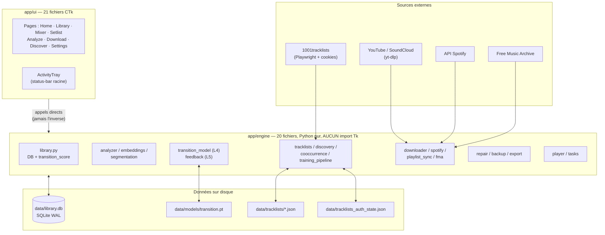

# Ultimate DJ — Carte vivante du projet

> **Document évolutif.** C'est LA vue d'ensemble : chaque sous-système, chaque
> item, la base de données, le pipeline IA, et leurs relations profondes.
>
> **Protocole de mise à jour** (chaque session qui fait bouger un item) :
> 1. Modifier la colonne **État** de l'item concerné (sections 1 et 6).
> 2. Ajouter une ligne datée au **Journal** (section 7). Ne jamais réécrire
>    l'historique.
> 3. Si les chiffres IA changent (pairs, loss, votes), mettre à jour la
>    section 3.
>
> Légende : ✅ livré et stable · 🟡 partiel / en cours · 🔴 à faire · ⏸️ reporté
>
> Documents frères : [AUDIT.md](AUDIT.md) (santé 12 dimensions, point-in-time),
> [ECC_USAGE.md](ECC_USAGE.md) (outillage IA de dev).
> **Version 3D interactive : [PROJECT_MAP.html](PROJECT_MAP.html)** — double-clic,
> s'ouvre dans le navigateur, 100 % offline (aucun CDN). Même snapshot de données.
> Inclut l'**arbre de quêtes** (bouton ⚔ dans le header) : chaque chantier en
> quête ✅/🟡/🔓/🔒 avec XP, dépendances, bloqueurs et prochaine quête recommandée.
> Snapshot initial : v1.4, 2026-07-02 — 18 142 LOC, 46 fichiers Python
> (5 racine + 20 engine + 21 ui).

---

## 0. Vue macro



Règle architecturale n°1 : `engine/` n'importe **jamais** `ui/`
(0 import inverse, vérifié). Les modules engine reçoivent `conn` en
paramètre — testables sans UI.

---

## 1. Arbre des sous-systèmes

### 1.1 Boot & fondations — ✅ stable

| Fichier | LOC | Rôle | État |
|---|---|---|---|
| `run.py` | — | Point d'entrée : check deps → `App().mainloop()` | ✅ |
| `app/__init__.py` | 28 | DPI awareness per-monitor, **AVANT tout import Tk** — ne pas déplacer | ✅ |
| `app/config.py` | 198 | Chemins, thème, opt-ins (`write_tags_to_files`=False par défaut) | ✅ |
| `app/deps.py` | 242 | Installeur premier-lancement ; torch + Chromium opt-in | ✅ |
| `app/logger.py` | 58 | Logger fichier rotatif (`log_info` / `log_warning`) | ✅ |
| `app/secrets_store.py` | 149 | Wrapper `keyring` → Windows Credential Manager (Spotify + 1001TL) ; migration auto du plaintext legacy | ✅ |

Boot < 1 s à cache chaud (imports lazy, librosa différé en worker).

### 1.2 Bibliothèque & données — ✅ cœur stable, 🟡 volume

| Fichier | LOC | Rôle | État |
|---|---|---|---|
| `engine/library.py` | 1377 | Schéma DB + migrations inline, `transition_score()` (scorer central L1-L5), trash/undo 30 j, `find_audio_duplicate()` (moitié audio du matching hybride) | ✅ (🟡 1377 LOC — extraire le scoring un jour) |
| `ui/library.py` | 792 | Treeview + filtres + ops bulk + panneau transitions | ✅ |
| `ui/fastlist.py` | 291 | Liste virtualisée performante | ✅ |
| `ui/track_editor.py` | 424 | Édition métadonnées d'un track | ✅ |
| `ui/duplicates.py` | 333 | Détection/fusion de doublons | ✅ |
| `ui/camelot.py` | 200 | Roue Camelot interactive | ✅ |

### 1.3 Analyse audio — ✅ livré, 🔴 write_tags gelé

| Fichier | LOC | Rôle | État |
|---|---|---|---|
| `engine/analyzer.py` | 249 | BPM / key / energy via librosa ; `write_tags()` **gated opt-in** | ✅ analyse · 🔴 write_tags gelé tant que repair v2 pas livré |
| `engine/embeddings.py` | 366 | **L1** — fingerprint 256-d (lite/CLAP/PANNs), L2-normalisé, stocké en BLOB dans `tracks.embedding` | ✅ |
| `engine/segmentation.py` | 173 | **L3** — intro/outro/drops par enveloppe RMS → `tracks.intro_end/outro_start/drops` | ✅ |
| `ui/analyze.py` | 301 | Page analyse batch avec progression | ✅ |

### 1.4 Acquisition de musique — ✅ livré

| Fichier | LOC | Rôle | État |
|---|---|---|---|
| `engine/downloader.py` | 364 | Wrapper yt-dlp (auto-update hebdo) | ✅ |
| `engine/spotify.py` | 151 | Résolution playlists/métadonnées Spotify | ✅ |
| `engine/playlist_sync.py` | 238 | Sync playlist Spotify → téléchargements | ✅ |
| `engine/fma.py` | 365 | Import dataset FMA Small (corpus d'entraînement, source='fma') | ✅ |
| `ui/download.py` | 903 | Page download : browser de dossiers + résolution Spotify | ✅ (🟡 903 LOC) |
| `ui/browser.py` + `ui/_browser_launcher.py` | 507+82 | WebView2 embarqué (Spotify/SoundCloud) ; force-scale-factor=1 + DPI avant `import webview` | ✅ |

### 1.5 Scraping & corpus DJ — ✅ pipeline complet

| Fichier | LOC | Rôle | État |
|---|---|---|---|
| `engine/tracklists.py` | 1234 | Scraping 1001tracklists : login Chromium visible, cookies `_AUTH_STATE_PATH` rechargés cross-thread par mtime, Playwright **thread-local** (`_PW_TLS`), parse schema.org, matcher hybride precision-first (token-sort noms + dedup audio cosine 0.92) | ✅ (🟡 1234 LOC, 3 responsabilités à séparer) |
| `engine/discovery.py` | 371 | Découverte de tracklists par artiste | ✅ |
| `engine/cooccurrence.py` | 333 | **L2** — mine les sets scrapés → `track_pairs` (decay positionnel) | ✅ 582 paires |
| `engine/training_pipeline.py` | 474 | Enrichisseur bout-en-bout : discover → scrape → match → download → analyse → train ; mode `embeddings_only` purge l'audio après features | ✅ |
| `ui/discover.py` | 695 | Akinator artistes + batch scraper + import URL | ✅ |

### 1.6 Modèle IA & feedback — ✅ entraîné sur données réelles

| Fichier | LOC | Rôle | État |
|---|---|---|---|
| `engine/transition_model.py` | 591 | **L4** — Siamese 134-d→64-d, contrastive loss, `data/models/transition.pt` ; `bootstrap_pairs()` cold-start ; `maybe_auto_retrain()` (lock anti-concurrence) | ✅ loss 0.29 |
| `engine/feedback.py` | 228 | **L5** — 👍/👎 → `transition_feedback` → modifier +12/−25 + corpus L4 | ✅ |

### 1.7 Mix, lecture & setlists — ✅ livré

| Fichier | LOC | Rôle | État |
|---|---|---|---|
| `engine/player.py` | 561 | Lecture audio sounddevice, waveform | ✅ |
| `engine/tasks.py` | 190 | File de jobs d'arrière-plan (alimente l'ActivityTray) | ✅ |
| `ui/mixer.py` | 673 | Double deck + suggestions scorées + breakdown popup + boutons feedback | ✅ |
| `ui/deck.py` | 533 | Widget deck (waveform, cues, transport) | ✅ |
| `ui/setlist.py` | 557 | Constructeur de setlists (slots JSON en DB) | ✅ |
| `engine/export.py` + `ui/export_dialog.py` | 162+124 | Export setlists/lib (M3U, Rekordbox…) | ✅ |

### 1.8 Maintenance & sécurité fichiers — 🔴 chantier prioritaire

| Fichier | LOC | Rôle | État |
|---|---|---|---|
| `engine/repair.py` | ~520 | Réparation v1 (préfixe ID3 avant RIFF) + **v2** (walker de chunks RIFF : trailing `id3` tronqué, taille RIFF corrigée, tail sauvegardé dans `data/repair_tails/` → undo intégral) | ✅ v1+v2 livrés · ⏳ exécution sur les 363 WAV au clic user |
| `engine/backup.py` | 159 | Sauvegarde DB | ✅ |
| flag `tracks.corrupt` | — | Badge ⚠ en Library quand container corrompu | ✅ détection |

### 1.9 Chrome UI — ✅ stabilisé

| Fichier | LOC | Rôle | État |
|---|---|---|---|
| `ui/app.py` | 349 | Racine CTk : sidebar + frame contenu + **tray docké en bas de la racine** (pack `side="bottom"` — jamais `place()`) | ✅ |
| `ui/activity_tray.py` | 263 | Barre de statut des jobs — indestructible aux changements de page | ✅ |
| `ui/home.py` | 178 | Dashboard d'accueil | ✅ |
| `ui/toast.py` | 185 | Notifications éphémères | ✅ |
| `ui/helpers.py` | 221 | Utilitaires CTk partagés | ✅ |
| `ui/settings.py` | 1959 | ~15 sections de réglages | 🟡 fonctionne mais **doit être splitté en package** (item B3) |

---

## 2. Base de données — `data/library.db` (SQLite WAL, connexions thread-local `library._local`)

### `tracks` — la table centrale (1 ligne = 1 fichier audio)

| Colonne | Type | Écrit par | Lu par |
|---|---|---|---|
| `path` PK | TEXT | scan Library / download | tout le monde |
| `title, bpm, key, camelot, energy, duration` | — | `analyzer` | Mixer, Library, transition_score |
| `rating, genre, tags, cue_points, bpm_locked` | — | `track_editor`, Library | Library, export |
| `key_confidence, beat_grid, added_at` | — | `analyzer` | Mixer, deck |
| `corrupt` | INT | scan repair | badge ⚠ Library |
| `embedding` (BLOB 256-d) + `embedding_backend` | — | **L1** `embeddings.bulk_encode()` | transition_score, dedup audio, features L4 |
| `intro_end, outro_start, drops` | — | **L3** `segmentation.detect_structure()` | Mixer (points de mix), scoring outro_A vs intro_B |
| `source` | 'user' / 'training' / 'fma' | training_pipeline | filtre des pages user (training/fma cachés) |
| `audio_purged` | INT | mode embeddings_only | Library refuse de charger le fichier ; le modèle score quand même |

### Tables satellites

| Table | Colonnes | Rempli par | Consommé par |
|---|---|---|---|
| `track_pairs` (**L2**) | path_a, path_b, weight, sets | `cooccurrence.rebuild()` depuis le cache scrapé | `transition_score` (bonus co-occurrence), `extract_pairs` L4 |
| `transition_feedback` (**L5**) | path_a, path_b, like_score, created_at, source | `feedback.record()` (Mixer 👍/👎) | `transition_score` (+12/−25), corpus L4, seuil auto-retrain |
| `setlists` | id, name, created_at, updated_at, slots_json | page Setlist | page Setlist, export |
| `trash` | path, deleted_at, track_json, file_deleted | suppression bulk Library | Undo 30 j, purge auto |

### Fichiers de données hors DB

| Fichier | Contenu | Écrit par | Lu par |
|---|---|---|---|
| `data/tracklists/<slug>.json` | Tracklists parsées brutes (cache) | `tracklists.fetch_tracklist` | `cooccurrence.rebuild`, ré-analyse sans re-scrape |
| `data/tracklists_auth_state.json` | Cookies session 1001TL (gitignoré) | flow login | `_get_thread_browser()` de chaque thread (reload par mtime) |
| `data/models/transition.pt` | Poids Siamese L4 | `transition_model.train()` | `transition_model.score()` (lazy load) |
| `config.json` | Réglages (secrets migrés → keyring) | Settings | boot |

---

## 3. Pipeline IA — 5 couches, toutes branchées dans `library.transition_score()`

| Couche | Module | Entrée | Sortie / stockage | État chiffré (2026-07-02) |
|---|---|---|---|---|
| **L1 Embeddings** | `embeddings.py` | audio décodé | vecteur 256-d → `tracks.embedding` | ✅ 1033/1066 tracks user encodés |
| **L2 Co-occurrence** | `cooccurrence.py` | cache `data/tracklists/*.json` + matcher hybride | `track_pairs` (weight à decay positionnel) | ✅ 584 paires ← 57 tracklists (2026-07-05 ; était 8 avant le matcher hybride) |
| **L3 Segmentation** | `segmentation.py` | enveloppe RMS | `intro_end / outro_start / drops` | ✅ 1066/1066 segmentés |
| **L4 Siamese** | `transition_model.py` | 134-d = 128-d embedding + 6 scalaires contextuels → 64-d, contrastive | `data/models/transition.pt` ; ±10 pts dans le score | ✅ loss **0.2761** (retrain auto du pipeline, 2026-07-05, 20 epochs) — était 0.29, et 0.60 en bootstrap-distillation |
| **L5 Feedback** | `feedback.py` | 👍/👎 Mixer | `transition_feedback` ; +12/−25 immédiat + auto-retrain à Δ10 votes | ✅ branché (2 votes capturés — signal encore mince) |

**Formule du score** (dans `library.transition_score(a, b)`) :
heuristique de base (compat BPM + roue Camelot + delta energy)
→ + similarité cosine L1 → + bonus co-occurrence L2 → scoring
outro(A)/intro(B) via L3 → ± 10 pts L4 → modificateur L5.
Le popup breakdown du Mixer expose chaque composante.

---

## 4. Relations profondes — les 5 flux end-to-end

### Flux 1 — Import & analyse d'un track
```
Download/Scan ─→ analyzer.analyze() (BPM/key/energy, librosa en worker)
             ─→ embeddings.encode()             [L1]
             ─→ segmentation.detect_structure() [L3]
             ─→ library.upsert_track()  → ligne `tracks` complète
```
Ordre important : `training_pipeline.analyze_into_db` embed **avant**
l'upsert pour que le dedup audio puisse court-circuiter les doublons.

### Flux 2 — Corpus & entraînement (le "moteur de croissance" IA)
```
discovery (recherche artiste) ─→ tracklists.fetch_tracklist (Playwright,
   cookies thread-local) ─→ cache data/tracklists/*.json
─→ tracklists.match_with_library (token-sort ≥ seuil strict
   + library.find_audio_duplicate cosine 0.92)
─→ cooccurrence.rebuild() → track_pairs                        [L2]
─→ transition_model.extract_pairs (pairs + feedback) → train() [L4]
─→ data/models/transition.pt
```
`training_pipeline.enrich_corpus()` orchestre tout ça en un bouton.

### Flux 3 — Scoring d'une transition (Mixer)
```
ui/mixer ─→ library.transition_score(A, B)
   ├─ heuristique BPM/Camelot/energy   (tracks)
   ├─ cosine(embedding_A, embedding_B) [L1]
   ├─ lookup track_pairs               [L2]
   ├─ outro_A vs intro_B               [L3]
   ├─ transition_model.score() ± 10    [L4]
   └─ feedback.score_modifier +12/−25  [L5]
─→ popup breakdown affiche la décomposition
```

### Flux 4 — Boucle de feedback (l'app apprend du user)
```
Mixer 👍/👎 ─→ feedback.record() → transition_feedback
   ├─ effet immédiat : modificateur dans transition_score
   └─ effet différé : maybe_auto_retrain() à Δ10 votes
      → les votes deviennent des exemples d'entraînement L4
```

### Flux 5 — Sécurité fichiers (l'unique chemin d'écriture audio)
```
write_tags_to_files=False (défaut) ─→ AUCUNE écriture audio, jamais
Si opt-in : analyzer.write_tags() / engine.repair UNIQUEMENT
   🔴 repair v2 pending : tronquer le chunk id3 trailing des 363 WAV
   🔴 guard rails pending : opt-in PAR format + magic-byte pre-flight
      + assertion round-trip post-save
```

### Couplages UI → engine (nombre d'imports mesuré)

`settings.py` → 31 · `library.py` → 10 · `mixer.py` / `discover.py` → 5 ·
`app.py` → 4 · `download.py` / `track_editor.py` → 3 · autres → 1-2.
Les deux hubs engine les plus consommés : `library` et `analyzer` —
attendu, pas un smell.

---

## 5. Invariants à ne jamais casser (résumé exécutable)

1. `engine/` sans import Tk ; UI → engine, jamais l'inverse.
2. DPI awareness dans `app/__init__.py` avant tout import Tk.
3. Connexions DB thread-local (`library._local`) ; pas de connexion globale.
4. Playwright thread-local (`tracklists._PW_TLS`) via `_get_thread_browser()`.
5. ActivityTray = status-bar packée sur la racine, pas de `place()`.
6. Aucune mutation `.wav/.flac/.m4a` hors `engine.repair` / `write_tags()` opt-in.
7. Pas de trailer `Co-Authored-By: Claude` ; README synchronisé à chaque push.

---

## 6. Carte d'avancement — les 13 items actifs

Reprend les 3 sprints de [AUDIT.md](AUDIT.md) ; c'est CETTE table qui bouge
au fil des sessions. **Plan d'exécution détaillé des 4 chantiers actifs
(A1, C1, C3, L5 + satellites A2-A4, C4) : [PLAN_CHANTIERS.md](PLAN_CHANTIERS.md).**

### Sprint A — « Réparer les dégâts » (sécurité fichiers)

| Item | Description | État |
|---|---|---|
| **A1** | `repair_v2()` : tronquer le chunk `id3` trailing des 363 WAV + corriger la taille RIFF | ✅ code livré 2026-07-02 (`inspect_chunks`/`repair_trailing`/`undo_trailing`, backup tails, dry-run réel = **363/451 détectés, 0 faux positif**) · ⏳ exécution réelle = clic user « Réparer » (échantillon 10 → Rekordbox → le reste) |
| **A2** | Guard rails écriture : opt-in par format + pre-flight magic-byte + assertion round-trip | ✅ livré 2026-07-02 (`should_write_tags_for`, pre-flight non-MP3, WAV verified-or-reverted byte-identique) |
| **A3** | UI bulk-repair dans Settings (« Réparer la lib ») avec progression | ✅ livré 2026-07-02 (boutons existants v1 étendus : compte v2/review, cases par format dans Interop) |
| **A4** | Tests du chemin d'écriture (doit échouer si un octet sort du chunk `data`) | ✅ livré 2026-07-02 (16 tests `test_repair_v2.py` : walker, truncate, idempotence, review-refus, undo byte-identique, guards write) |

### Sprint B — « Verrouiller la qualité »

| Item | Description | État |
|---|---|---|
| **B1** | Tests : parser tracklists + matcher + plage d'inférence L4 | ✅ livré 2026-07-05 — **41 tests** (12 au départ) : fixture schema.org, précision matcher, L4-None, repair v2, ordre playlists, setlist.fm |
| **B2** | Audit des 122 `except Exception: pass` → narrow / log / propager | 🟡 passe data-path faite 2026-07-05 (11 `log_warning` : JSON corrompus, scrape→cache, BLOB, durée 0) ; reste les sites best-effort/UI majoritairement légitimes |
| **B3** | Splitter `ui/settings.py` (1959 LOC) en package `settings/` | 🔴 |
| **B4** | CI GitHub Actions : pytest + ruff sur chaque push | ✅ livré 2026-07-05 (`.github/workflows/ci.yml`, windows-latest, ruff non-bloquant + pytest bloquant) |
| **B5** | Distribution : installeur + code signing (SmartScreen) | 🔴 backlog (débloqué par B4) |

### Sprint C — « Faire grandir le signal IA »

| Item | Description | État |
|---|---|---|
| **C1** | Scraper d'autres catalogues à fort taux de match (Pegassi, Maceo Plex…) | 🟡 pipeline opérationnel (55 tracklists faites), extension à la demande |
| **C2** | Fallback setlist.fm (`engine/setlist_fm.py`) si 1001TL verrouille | 🟡 squelette livré 2026-07-05 (REST stdlib, mapping cover→artiste, écrit au format cache cooccurrence, 3 tests mockés) — reste ta clé API gratuite + bouton UI |
| **C3** | Exposer le delta L4-vs-heuristique dans le breakdown du Mixer | ✅ livré 2026-07-02 (`l4_verdict` engine + bannière popup + colonne L4 + encart doute) — à valider visuellement dans l'app |
| **C4** | Auto-retrain aussi après chaque `cooccurrence.rebuild()` (pas seulement à Δ10 votes) | ✅ livré 2026-07-02 (hook gardé par toggle `ai_auto_retrain` + changement réel de paires) |

**Prochain focus suggéré** : C3 (petit, visible, fait briller le modèle) ou
A1 (dette la plus dangereuse) selon l'humeur de la session.

---

## 7. Journal des mises à jour

| Date | Session | Changement |
|---|---|---|
| 2026-07-02 | création | Snapshot initial v1.4. Tous sous-systèmes livrés sauf sprints A/B/C ci-dessus. L4 à loss 0.29 (données réelles), 582 paires L2, 1033/1066 embeddings, tray stabilisé, secrets keyring, matcher hybride livré. |
| 2026-07-02 | plan | [PLAN_CHANTIERS.md](PLAN_CHANTIERS.md) créé pour les 4 chantiers actifs. Recon clé : `repair.inspect()` v1 rend « ok » sur les 363 WAV du bug v2 (corruption APRÈS le chunk data) → la v2 exige un walker de chunks RIFF. Ordre retenu : Phase 1 C3→L5→C4 (zéro risque fichier), Phase 2 C1 en continu, Phase 3 A4→A1→A2→A3 au GO user. |
| 2026-07-02 | phase 1 | **C3 + L5-friction + C4 livrés** (+251/−22 sur 5 fichiers). C3 : `l4_verdict()` + 3 clés breakdown (library.py), bannière verdict popup + colonne L4 (mixer.py). L5 : touches F/D/X, encart « L4 doute » (active learning), delta votes/seuil dans le statut Settings. C4 : retrain post-rebuild gardé par opt-in + delta paires. Bonus : fix schéma `init_schema` (colonnes `source`/`audio_purged` manquantes → test cooccurrence cassé). pytest 14/14 ✅. Non commité. |
| 2026-07-06 | L1 calibré | **Axe audio ressuscité** : `similarity_score` calibré sur la distribution de la lib (p5→0, p95→100, cache invalidé à chaque `set_embedding`, fallback legacy < 50 embeddings). Mesuré sur 500 paires réelles : std **1.9 → 26.4**, p5-p95 94→100 devient **0→100**. Breakdown affiche « cosine 0.94 → 62 calibré ». pytest 46/46 ✅. Reste en quêtes : badge bitrate, éval L4 (AUC), split settings.py. |
| 2026-07-06 | bug dédup destructeur + L1 saturé | **Batch 2 terminé : 1106 téléchargés MAIS 0 stocké** — `analyze_into_db` a supprimé (`os.remove`) les 1106 fichiers comme « audio-dups » : le backend lite produit des cosines ~0.97 entre tracks ALÉATOIRES (Janet Jackson ≈ Skrillex à 0.9999). Fix : le verdict dup exige désormais une confirmation par nom (`_confirms_duplicate` ≥ 0.75) avant skip/remove + test de régression sur les paires réelles du log. pytest 44/44 ✅. Batch 3 relancé. **Découverte majeure mesurée : l'axe L1 du score est saturé** (cosine moyen 0.971, p5 0.886 → l'axe audio vaut 95-100 pour toutes les paires = quasi-constant, pas un discriminateur) → quête prioritaire : rescaling percentile de L1 (sans nouveau backend). |
| 2026-07-05 | v1.5 pushed + pilote réparation + FMA purge | **Push GitHub** : 3 commits (`5da0a3f` v1.5, `369b3aa` CI, `bf62784` docs), auteur solo. **Évaluation DJ** livrée (chat) — verdicts clés : app 3,3 Mo vs 17 Go de caches ; FMA 12 Go / 0 ligne DB ; 87/1104 beat grids ; 0 setlist utilisée. **Pilote réparation : 10/10 WAV réparés + vérifiés machine** (auto-undo armé, 0 échec), 353 flagués `corrupt=1` (le scan persiste désormais les flags → badges Library réels) — attente vérif Rekordbox user avant les 353. **FMA purgé : −12,07 Go** via les fonctions de l'app. Contrainte user respectée : PAS de ré-analyse beat-grid librosa (pas meilleur que Rekordbox) — vérifié : l'export XML n'écrit aucune grille. Badge bitrate → quête dispo. |
| 2026-07-05 | download UX | **2 demandes user livrées** : ① modal de **sélection des tracks** avant tout téléchargement de playlist (> 1 track) — cases pré-cochées, filtre, compteur live, Tout/Rien, bouton « Télécharger N » ; ② **bootstrap du cache de sync depuis le dossier** (`playlist_sync.bootstrap_cache_from_folder`) : un dossier téléchargé avant l'existence du sync est reconnu par match flou des fichiers → seuls les nouveaux morceaux téléchargent (texte du modal resync adapté). Bonus : fix des doubles espaces dans `_norm` partagé (améliore aussi le matching de `merge_after_download`). +3 tests. pytest **43/43** ✅. |
| 2026-07-05 | complétion max | **5 quêtes avancées en une passe** : B1 ✅ (41 tests — fixture parser schema.org, précision matcher, L4-None), B4 ✅ (CI windows-latest), B2 🟡 70 % (11 log_warning data-path, contrôle de flux intact), C2 🟡 80 % (squelette `setlist_fm.py` REST + 3 tests mockés — reste clé API), CR ✅ (IP sondée LIBRE → batch 2 relancé, **les téléchargements passent : ~180/608 [ok]**, rebuild+retrain suivront). pytest **41/41** ✅. Arbre de quêtes ~68 %. Non commité. |
| 2026-07-05 | arbre de quêtes | PROJECT_MAP.html : ajout du système de quêtes (bouton ⚔) — 20 quêtes sur 5 lanes (Fondations/A/B/C/Découvertes), arbre SVG de dépendances, XP 261/555 (47 %), statuts ✅🟡🔓🔒 avec bloqueurs, panneau détail par quête, « prochaine recommandée » = ⚔ Réparer les 363 WAV. Chiffres du HTML resynchronisés (584 paires, loss 0.276). |
| 2026-07-05 | batch C1 + fix downloader | **Batch C1 terminé** : 10 artistes, 57 sets (47 cache), retrain L4 → loss **0.2761** ; MAIS 608/608 téléchargements échoués + 1001TL a rate-limité l'IP en découverte. Root cause downloads (prouvée par A/B probe) : `_yt_base_opts` épinglait `player_client:["web"]` ET attachait `cookiesfrombrowser` — les deux forcent le client web de YouTube, désormais muré par PO-token → zéro format. Les deux retirés (workarounds 2025 devenus poisons), vérifié par un vrai téléchargement end-to-end (ok=1). Paires 582→584 seulement (aucun nouveau track) — **relancer le batch quand l'IP 1001TL est débloquée** : les 608 manquants téléchargeront cette fois. pytest 33/33 ✅. |
| 2026-07-02 | bug ordre playlists | **Ordre Spotify préservé au téléchargement.** Cause 1 : `playlist_sync.compute_diff` construisait `added` via une différence d'ensembles (ordre arbitraire) → réécrit en marche ordonnée sur la source (added/kept/missing en ordre playlist). Cause 2 : aucune matérialisation de l'ordre sur disque (yt-dlp nomme `Artist - Title` → tri alphabétique) → `write_m3u()` écrit `<playlist>.m3u8` (UTF-8, chemins relatifs) dans le dossier à chaque sync, importable Rekordbox/Engine/VLC, zéro renommage audio. +2 tests régression. pytest 33/33 ✅. |
| 2026-07-02 | phases 2+3 | **Chaîne A livrée en TDD** : A4 (16 tests fixtures synthétiques) → A1 (walker RIFF `inspect_chunks`, `repair_trailing` avec tail backup + `undo_trailing` byte-identique, `scan_folder` v1+v2) → A2 (opt-in par format `should_write_tags_for`, pre-flight magic, WAV verified-or-reverted — le vecteur actif était le wrapper WAVE de mutagen) → A3 (Settings : compte v2/review, cases par format). **Dry-run réel : 363/451 trailing détectés, 0 faux positif** — réparation effective au clic user. Phase 2 : batch C1 lancé, a débusqué un bug de contrat `resolve_missing` ↔ matcher hybride (AttributeError) → corrigé + test régression + garde anti-placeholder ID, batch relancé. pytest **31/31** ✅. Smoke Mixer headless OK. Non commité. |
